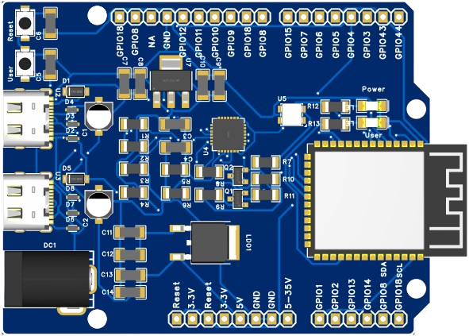
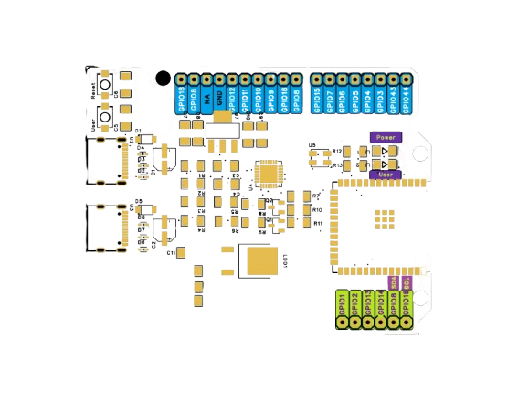

# 🚀 **ESP32-S3 UNO-Compatible Development Board**

## 🖼️ Demo 3D Model


## 🖼️ Demo 2D Model



This is a custom-designed ESP32-S3-based Arduino UNO-style development board with colorful silkscreen pin labels and USB Type-C support. It supports ESP-IDF, Arduino, and MicroPython platforms.

---

## 📌 **Key Features**

- 🔹 ESP32-S3-WROOM-1-N8R8 / N16 module
- 🔹 UNO-style pin headers (Digital, Analog, Power)
- 🔹 USB Type-C programming and power
- 🔹 CP2102N USB to UART bridge
- 🔹 Onboard 5V (7805) and 3.3V (SGM2212) regulators
- 🔹 User LED on **GPIO48**
- 🔹 Reset & Boot tactile buttons
- 🔹 ESD and Schottky protection diodes
- 🔹 Colorful silkscreen pin labeling (Power, Analog, Digital, I2C)

---

## 🧩 **Bill of Materials (BOM)**

| #  | LCSC#     | MPN                   | Description           | Qty | Link                                                                                                                                     |
| -- | --------- | --------------------- | --------------------- | --- | ---------------------------------------------------------------------------------------------------------------------------------------- |
| 1  | C2988369  | GT-USB-7010ASV        | USB Type-C 3A 16P     | 5   | [Link](https://lcsc.com/product-detail/usb-connectors_g-switch-gt-usb-7010asv_C2988369.html)                                             |
| 2  | C82544    | 1N5819HW-7-F          | 40V 1A Schottky Diode | 20  | [Link](https://lcsc.com/product-detail/schottky-diodes_diodes-1n5819hw-7-f_C82544.html)                                                  |
| 3  | C964632   | CP2102N-A02-GQFN28R   | USB to UART           | 1   | [Link](https://lcsc.com/product-detail/usb-converters_silicon-labs-cp2102n-a02-gqfn28r_C964632.html)                                     |
| 4  | C165948   | TYPE-C-31-M-12        | Type-C Female 5A      | 5   | [Link](https://lcsc.com/product-detail/usb-connectors_korean-hroparts-elec-type-c-31-m-12_C165948.html)                                  |
| 5  | C2907406  | FRC1206P000 TS        | 0Ω Resistor, 1206     | 100 | [Link](https://lcsc.com/product-detail/chip-resistor-surface-mount_fojan-frc1206p000-ts_C2907406.html)                                   |
| 6  | C14860    | CL31B106KAHNNNE       | 10uF 25V MLCC         | 10  | [Link](https://lcsc.com/product-detail/multilayer-ceramic-capacitors-mlcc-smd-smt_samsung-electro-mechanics-cl31b106kahnnne_C14860.html) |
| 7  | C13585    | CL31A106KBHNNNE       | 10uF 50V MLCC         | 10  | [Link](https://lcsc.com/product-detail/multilayer-ceramic-capacitors-mlcc-smd-smt_samsung-electro-mechanics-cl31a106kbhnnne_C13585.html) |
| 8  | C2907440  | FRC1206J102 TS        | 1kΩ Resistor, 1206    | 100 | [Link](https://lcsc.com/product-detail/chip-resistor-surface-mount_fojan-frc1206j102-ts_C2907440.html)                                   |
| 9  | C22375106 | FRC1206F4752TS        | 47.5kΩ Resistor       | 100 | [Link](https://lcsc.com/product-detail/chip-resistor-surface-mount_fojan-frc1206f4752ts_C22375106.html)                                  |
| 10 | C488738   | RC1206FR-0722R1L      | 22.1Ω Resistor, 1206  | 100 | [Link](https://lcsc.com/product-detail/chip-resistor-surface-mount_yageo-rc1206fr-0722r1l_C488738.html)                                  |
| 11 | C28322    | CL31B105KAHNNNE       | 1uF 25V MLCC          | 10  | [Link](https://lcsc.com/product-detail/multilayer-ceramic-capacitors-mlcc-smd-smt_samsung-electro-mechanics-cl31b105kahnnne_C28322.html) |
| 12 | C24497    | CL31B104KBCNNNC       | 100nF 50V MLCC        | 40  | [Link](https://lcsc.com/product-detail/multilayer-ceramic-capacitors-mlcc-smd-smt_samsung-electro-mechanics-cl31b104kbcnnnc_C24497.html) |
| 13 | C2913201  | ESP32-S3-WROOM-1-N8R8 | WiFi Module           | 2   | [Link](https://lcsc.com/product-detail/wifi-modules_espressif-esp32-s3-wroom-1-n8r8_C2913201.html)                                       |
| 14 | C2913199  | ESP32-S3-WROOM-1-N16  | Alt. WiFi Module      | 1   | [Link](https://lcsc.com/product-detail/wifi-modules_espressif-esp32-s3-wroom-1-n16_C2913199.html)                                        |
| 15 | C3294699  | SGM2212-3.3XKC3G      | 3.3V LDO Regulator    | 5   | [Link](https://lcsc.com/product-detail/voltage-regulators-linear-low-drop-out-ldo-regulators_sgmicro-sgm2212-3-3xkc3g-tr_C3294699.html)  |
| 16 | C2907509  | FRC1206J512 TS        | 5.1kΩ Resistor        | 200 | [Link](https://lcsc.com/product-detail/chip-resistor-surface-mount_fojan-frc1206j512-ts_C2907509.html)                                   |
| 17 | C21706    | CJ7805 3%             | 5V LDO TO-252         | 5   | [Link](https://lcsc.com/product-detail/voltage-regulators-linear-low-drop-out-ldo-regulators_jscj-cj7805-3_C21706.html)                  |
| 18 | C383211   | LESD5D5.0CT1G         | TVS ESD Diode         | 50  | [Link](https://lcsc.com/product-detail/esd-and-surge-protection-tvs-esd_lrc-lesd5d5-0ct1g_C383211.html)                                  |
| 19 | C49581    | L8050QLT1G            | NPN BJT, SOT-23       | 100 | [Link](https://lcsc.com/product-detail/bipolar-bjt_lrc-l8050qlt1g_C49581.html)                                                           |
| 20 | C2933675  | FRC1206F3300TS        | 330Ω Resistor         | 100 | [Link](https://lcsc.com/product-detail/chip-resistor-surface-mount_fojan-frc1206f3300ts_C2933675.html)                                   |
| 21 | C2922787  | SK6812MINI-HS         | RGB LED (WS2812C)     | 5   | [Link](https://lcsc.com/product-detail/rgb-leds-built-in-ic_opsco-optoelectronics-sk6812mini-hs_C2922787.html)                           |
| 22 | C455280   | TS-1088R-02026        | Tactile Button        | 10  | [Link](https://lcsc.com/product-detail/tactile-switches_xunpu-ts-1088r-02026_C455280.html)                                               |

---

## 🔧 **How to Program**

1. Plug in via **USB Type-C**
2. Select the **CP2102N COM port** in Arduino IDE
3. Select board: `ESP32-S3 Dev Module`
4. Upload code

```cpp
// Blink LED Example
void setup() {
  pinMode(48, OUTPUT);
}

void loop() {
  digitalWrite(48, HIGH);
  delay(500);
  digitalWrite(48, LOW);
  delay(500);
}
```

---

## 🎨 **Silkscreen Color Key**

| Function       | Background     | Text Color | Sample |
| -------------- | -------------- | ---------- | ------ |
| Power Pins     | 🟨 Yellow       | ⚫ Black    | `3.3V`, `5V`, `VIN` |
| Digital Pins   | 🟦 Blue         | ⚪ White    | `GPIO0–GPIO18`      |
| Analog Pins    | 🟩 Lime Green   | ⚫ Black    | `A0–A5`             |
| I2C Pins       | 🟪 Purple       | ⚪ White    | `SDA`, `SCL`        |
| User Labels    | 🟪 Purple       | ⚪ White    | `Power`, `User`     |
---

## 📁 **Folder Structure**


```

---

## 🙏 Special Thanks

A big thank you to the following platforms for their amazing tools and support in designing this open-source hardware project:

<p align="center">
  &nbsp;&nbsp;&nbsp;&nbsp;
  
</p>

- **[EasyEDA](https://easyeda.com/)** – for their powerful PCB design tools  
- **[OSHWLab](https://oshwlab.com/)** – for hosting open-source hardware projects

Their platforms made this project possible and easy to share with the maker community ❤️

## 📬 License

Open Source Hardware — OSHWA Certified

---

Happy Making! 💡
